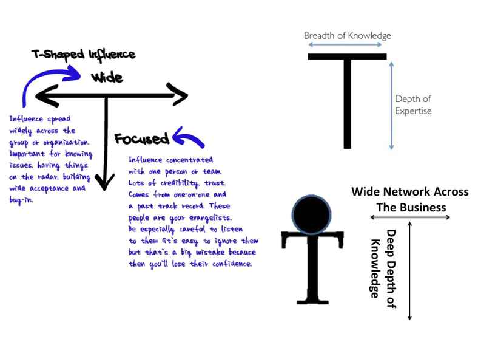

Gunter Dueck in his talk [The World after Cloud Computing & Big Data](http://www.infoq.com/presentations/cloud-computing-big-data) says:
> You should have at least T shape. This is the next preaching. The theory is 10 years old and now it becomes really serious.
> That's the content of my talk. It means technology people are deep, they know everything but only ten meters diameter on the world.
> Managers are know everything but nothing. They've heard everything.

Barbara Sher in her book [I Could Do Anything If I Only Knew What It Was](http://www.barbarasher.com/icoulddo.htm) writes:
> The first step is to understand who you really are—that is, why you want so many things. Once you know that, I’ll show you some further steps you can take to get yourself a life that suits you.
> There are two big reasons you might be wanting too many things and feeling all over the map about it.
> Reason No. 1: You’re a born scanner—you’re a person who delights in the astonishing, unending variety around us—but you don’t realize that being a scanner is a very respectable profession. You don’t yet know that scanning is a talent, the key to a very good life.
> Reason No. 2: You’re a born diver—you’re like a deep-sea diver; your curiosity makes you want to go deeper and deeper into your subject until you dedicate your entire life to it—but you appear to be a scanner at this moment because something’s blocking you from diving. In spite of how your life looks now, you are not really a scanner. You are the kind of person who loves to delve deeply into a subject. You need to figure out what’s stopping you from diving.

On this picture from the talk by Dueck wide are the managers and deep are the technology people.

Sher calls wide people scanners and deep people divers.

<h2 style="border-bottom-color: black; border-bottom-style: solid; border-bottom-width: 1px; border-top-color: black; border-top-style: solid; border-top-width: 1px; display: block; font-size: 1em; font-weight: bold; margin-bottom: 1em; margin-left: 0; margin-right: 0; margin-top: 2em; text-align: center">SCANNERS</h2>

Scanners want to taste everything. They love to learn about the structure of a flower, and they love to learn about the theory of music. And the adventures of travel. And the tangle of politics. To scanners, the universe is a treasure house full of a million works of art, and life is hardly long enough to see them all.

Robert Frost defined divers and scanners very neatly when he said “A scholar is someone who sticks to something. A poet is someone who uses whatever sticks to him.”

Because our culture values the diver’s specialization and determination, we too often think of scanners as people who simply won’t get down to work.

This is a foolish cultural oversight.

If you’re a scanner, <em style="font-style: italic">you have extraordinarily special and valuable skills</em>. You love what is new, and you don’t suffer from fear and indecisiveness. You’re highly adaptable to new cultures; you’re so flexible you can turn on a dime. You’re a lightning-fast learner, curious about anything you don’t already understand; you like and respect all kinds of thinking. Although you may be unwilling to dedicate yourself to one path, you don’t lack discipline or have a low IQ. On the contrary, you’re dedicated to learning all that you can, and you’re intelligent enough to delight in all that you learn.

<h3 style="display: block; font-size: 1em; font-weight: bold; margin-bottom: 1em; margin-left: 0; margin-right: 0; margin-top: 2em; text-align: center"><strong style="font-weight: bold"><em style="font-style: italic">Having It All: At Once</em></strong></h3>

In many cases the only problem for scanners is finding the kind of work that will allow them to use their talent for scanning. Career aptitude tests tend to miss scanners. Take Jack, for instance.

Jack went to the most respected career testing service he could find. His tests showed he was equally skilled in music, nature, mathematics, science, and literature. As a matter of fact, there was <em style="font-style: italic">no</em> subject for which he showed no aptitude!

The career counselors who tested him told Jack there was no way around it, he’d have to make a choice. “You can be a musician, a science teacher, a mathematician, or an editor in a publishing house. Which one do you want?”

Jack knew he wouldn’t be happy at any of them: “I’ve never gotten past Anything 101. In college, when I would take second and third courses in some discipline, like pre-med, or French literature, I’d feel like I was on a detour, off my path. What I really loved was the <em style="font-style: italic">overview</em>, the sense of where philosophy belongs in a person’s life, or history belongs, or physics, for that matter. Once I’d get something located, I wanted to look at something else.

“My advisors didn’t know what to do with me. They called me a perennial student. But I couldn’t make a choice. I racked up so many credits they <em style="font-style: italic">had to</em> graduate me after a while. And there I was, no wiser than before about what I was supposed to be when I grew up.”

Jack wandered for a few years, until he accidentally stumbled into a writing assignment for a newsletter to be handed out at a convention for inventors. He really enjoyed interviewing all the different inventors for this article, so he went looking for other writing assignments.

That was twenty years ago. Today Jack is a successful free-lance writer, and he loves his life. He just got back from touring the Far East with an American opera company, and this fall he’ll be on Mont Blanc in France with a group of French mountain climbers to write about their climb.

Jack is&mdash;and you might be&mdash;a popularizer. He can learn about biology, but what he likes to do with his knowledge of biology is translate it to the world&mdash;he’s a communicator. He’s a teacher.

It can take time and ingenuity to find a scanner’s niche, work that accommodates all of a scanner’s many interests. But the results are worth it.

Scanners <em style="font-style: italic">are</em> poets&mdash;and librarians, documentary filmmakers, explorers, brilliant salespeople, good managers, naturally gifted teachers.

We’re trained to believe that we only get one choice in our lives. But to scanners, one choice sounds like someone’s saying, “You can have a coloring book <em style="font-style: italic">or</em> you can have crayons, but you can’t have both,” and they’re onto something. Scanners know that life is not stingy. If anything, life is too generous. The choices are dizzying. But there’s a way to manage the riches.

<h3 style="display: block; font-size: 1em; font-weight: bold; margin-bottom: 1em; margin-left: 0; margin-right: 0; margin-top: 2em; text-align: center"><strong style="font-weight: bold"><em style="font-style: italic">Having It All: Sequentially</em></strong></h3>

One of the things that drive scanners to distraction is that they’re in a terrific hurry. But, although you should not waste any more time by being stuck, you should never hurry, because 1) there’s more time than you think, 2) hurry is inefficient, and 3) part of your problem is caused by what I call time sickness. Time sickness is a form of hysteria that makes you believe you must fill every waking hour going after what you want, that everything must be done at once because time is about to end. You have no sense of the future, the leisurely course that time actually takes in most of our lives. Writing lists only makes your problem worse, and calendars have to be used with great care or they’ll become packed with enough projects for a dozen people.

But the truth is, if you want to do a lot of things, you <em style="font-style: italic">can</em> do them all. Leonardo da Vinci, Thomas Jefferson, Ben Franklin, and Ted Turner knew that.

You just have to be shown that there is more time than you ever imagined.

<h3 style="display: block; font-size: 1em; font-weight: bold; margin-bottom: 1em; margin-left: 0; margin-right: 0; margin-top: 2em; text-align: center"><strong style="font-weight: bold"><em style="font-style: italic">Exercise 1: Time Management for the Person Who Loves to Do Too Many Things</em></strong></h3>
<h4 style="display: block; font-size: 1em; font-weight: bold; margin-bottom: -0.3em; margin-left: 0; margin-right: 0; margin-top: 2em; text-align: left"><strong style="font-weight: bold"><em style="font-style: italic">1. Ten lives</em></strong>.</h4>

If you were ten people, what would each of you do with your life? Take a pencil and a blank sheet of paper and write down each life. (Do you want more than ten lives? Go right ahead. Write down as many lives as you like!) When you’re finished, take a look at your list.

You might say, I want to be:

a poet

a musician

a successful businessperson

a scholar of Chinese culture

a gourmet cook

a world traveller

a gardener

a husband and father

a journalist

a talk-show host

With this list of everything you ever want to do, take a look at the available pieces of time in your future. <em style="font-style: italic">You’re about to find a way to live every one of your lives</em>.

<h4 style="display: block; font-size: 1em; font-weight: bold; margin-bottom: -0.3em; margin-left: 0; margin-right: 0; margin-top: 2em; text-align: left"><em style="font-style: italic">2</em>. <strong style="font-weight: bold"><em style="font-style: italic">Available time</em></strong>.</h4>

Quickly answer each of the following questions with one of your ten (or more) lives. Don’t think too much. Put down the first answer that pops into your head as you read each question. (It’s okay to use the same life several times.)

<ul style="display: block; list-style-type: none; margin-bottom: 1em; margin-left: 0; margin-right: 0; margin-top: 1em; text-align: justify; text-indent: -1em">
<li style="display: list-item">
 Which life can you devote yourself to this coming year?
</li>
<li style="display: list-item">
 Which life can you do when the first one is completed?
</li>
<li style="display: list-item">
 Which activities can you do for twenty minutes or less each day?
</li>
<li style="display: list-item">
 Which ones can you do on a weekend?
</li>
<li style="display: list-item">
 Which ones can you do once in a while?
</li>
</ul>

Answering these questions should give you a more realistic look at how people actually do things&mdash;when they’re “Renaissance men” like you are. Maybe you’ll stop thinking in either/or terms, as Ralph did when he said, “How can I go off and write poetry, and learn Chinese, and take violin, and still run my business and travel? Oh yes, and be a gourmet cook and garden?”

Here’s how: Don’t <em style="font-style: italic">go off and</em> write poetry. Just write poetry. Write a line at night before you go to sleep, and you’ll find yourself getting up very early to write some more.

If you get excited by your poem, push everything else aside. On your coffee breaks, pull out that poem and work on it. <em style="font-style: italic">And a few days later, you’ll be finished</em>. Then you may not want to write another poem for a month.

When will you study violin? How about next summer? The point is, you can do it all, if you schedule it right.

If you want to start a business but you also want to see the world, you can combine them or you can do them one at a time: business now, travel later.

<h4 style="display: block; font-size: 1em; font-weight: bold; margin-bottom: -0.3em; margin-left: 0; margin-right: 0; margin-top: 2em; text-align: left"><strong style="font-weight: bold"><em style="font-style: italic">3. Make a quick three-year plan</em></strong>.</h4>
<ul style="display: block; list-style-type: none; margin-bottom: 1em; margin-left: 0; margin-right: 0; margin-top: 1em; text-align: justify">
<li style="display: list-item">
Year 1:
</li>
<li style="display: list-item">
Year 2:
</li>
<li style="display: list-item">
Year 3:
</li>
</ul>

It’s funny how we forget the sequential possibilities of time. It’s as if we think if we don’t do everything <em style="font-style: italic">right now</em>, we won’t get to do <em style="font-style: italic">any</em> of it.

<em style="font-style: italic">You’ve got more time than you think</em>. Our days and years aren’t as neat and tidy as we think. People like us, who are torn between doing many things, want to break time up in an unrealistically rigid way, and we may feel a little slapdash when we don’t have ourselves on a tight schedule, but life <strong style="font-weight: bold"><em style="font-style: italic">is</em></strong> slapdash. I’ll show you what I mean.

<h4 style="display: block; font-size: 1em; font-weight: bold; margin-bottom: -0.3em; margin-left: 0; margin-right: 0; margin-top: 2em; text-align: left"><strong style="font-weight: bold">4. Map your life</strong>.</h4>

Look into your past. Did you try mountain climbing once? Do you go to movies a lot in one year and then stop going for two years? Well, that might be exactly the right way to live. You must learn to respect the wisdom of your natural instincts, because they are probably superb when it comes to weaving everything you need into your life.

The truth is that too rigid a schedule might <em style="font-style: italic">prevent</em> you from doing all the things you want. “I never get to draw anymore,” a busy home visiting nurse said to me recently. “I haven’t for years. I wish I had more time.”

“How much time does it take?” I asked. She looked surprised, as if she hadn’t thought of it that way. I asked her to take out a pencil and paper and do some drawing for three minutes. She did, and when she lifted her head she had a big smile on her face. “That was great!”

Maybe for the next few months she can only draw for a few minutes at a time, but this summer she might be able to take two weeks and go to an art workshop in the woods somewhere. If drawing makes her happy, there’s not a thing in the world to stop her from starting today.

<em style="font-style: italic">Don’t forget to plan for another of those lives you wrote down. You can do it three or four years down the road</em>. By then you’re going to be interested in new things. You might want to make a twenty-or thirty-year plan so you can fit in <em style="font-style: italic">everything</em> you ever dreamed of doing.

<em style="font-style: italic">If you’re a scanner, don’t do a thing to change yourself</em>. Instead of designing yourself to fit the world, you can design a life to fit your abundant gifts.

<em style="font-style: italic">But what if you’re really a frustrated diver?</em> There’s a very special group of people: they look like scanners and they act like scanners, but they aren’t. <em style="font-style: italic">They’re actually divers who are afraid of diving</em>.

<h2 style="border-bottom-color: black; border-bottom-style: solid; border-bottom-width: 1px; border-top-color: black; border-top-style: solid; border-top-width: 1px; display: block; font-size: 1em; font-weight: bold; margin-bottom: 1em; margin-left: 0; margin-right: 0; margin-top: 2em; text-align: center">DIVERS</h2>

Musicians, mathematicians, scientists, artists, professional athletes often fall into this category. They delight in the depths. When something interests a diver, they become transfixed. If scanners have wide-angle vision, divers have telescopic vision.

Divers aren’t satisfied with beginnings or quick insights: they like to hang on for the whole ride. They need to see how things come together in the end. If they find there is no end, no bottom to what they study, it’s because they’ve opened up a new depth, revealing new secrets and new puzzles, and then a diver is in heaven.

For example, to a diver, a flower is a pretty thing on the surface, but he wants to go deeper and learn about its amazing structure, and even deeper until he sees the flower as a tiny world with an old and honorable history. A diver knows that if he delves deeper into knowledge of a flower, it will transform itself into biology, chemistry, into molecules, into atoms. And this makes a flower open up to become the universe itself.

Such are the rich rewards of diving.

But if something’s blocking a diver’s desire, he often lives like a scanner&mdash;and is very unhappy with the scanner’s life. For a diver, to refuse to land anywhere, to hover and always keep all his options open, <em style="font-style: italic">is to do nothing</em>.

A happy scanner moves from one subject to another, sipping nectar like a bee, and says things like “That was great. What’s next?”

An unhappy diver says things like:

<ul style="display: block; list-style-type: none; margin-bottom: 1em; margin-left: 0; margin-right: 0; margin-top: 1em; text-align: justify; text-indent: -1em">
<li style="display: list-item">
 “I can never stick to anything. I hate to keep dropping my projects, but for some reason I just can’t stay with them.”
</li>
<li style="display: list-item">
 “I’ve lost touch with whatever it is I’m supposed to be about. I’m just fooling around.”
</li>
<li style="display: list-item">
 “I’ve never done what I wanted because I was afraid of committing and then finding out it was the wrong thing.”
</li>
</ul>

If you sound like these unhappy divers, what we’re looking at in your case is not a bunch of abilities in search of a job title, <em style="font-style: italic">we’re looking at a problem</em>. You know perfectly well that you get restless and bored as long as you stay on the surface of things, but every time you start going into deeper waters, you mysteriously lose focus or get anxious. You don’t know <em style="font-style: italic">why</em> you can’t change <em style="font-style: italic">because you don’t know what’s causing the problem</em>.

First, <em style="font-style: italic">find out if your inability to focus has a physical cause</em>. You may be one of the many people with Attention Deficit Disorder (A.D.D.), a physical condition caused by poor regulation of the neurotransmitters in the brain that help people focus. If your mind wanders while you read and if it’s sometimes an hour before you notice that your mind has wandered, if your friends and colleagues think you’re hyperactive, or if you’ve simply always been frustrated because you’ve never been able to focus and follow through on projects you like, you may have A.D.D. A psychiatrist can diagnose you. A psychopharmacologist can prescribe caffeine or Ritalin to help you. And it’s even <em style="font-style: italic">more</em> important for you than for the rest of us to break down every big goal into small, specific, achievable steps <em style="font-style: italic">and</em> to get a person to hold you accountable for completing each of the small steps.

<h3 style="display: block; font-size: 1em; font-weight: bold; margin-bottom: 1em; margin-left: 0; margin-right: 0; margin-top: 2em; text-align: center"><strong style="font-weight: bold"><em style="font-style: italic">The Unfulfilled Diver</em></strong></h3>

If you find no physical cause for your inability to focus, then you’re a diver who’s behaving like a scanner. Changing your mind all the time isn’t an exercise of free choice, <em style="font-style: italic">it’s a defense mechanism</em>.

Consider the story of Lydia:

Lydia worked as a street vendor and made good money, but she couldn’t see street vending as her lifetime career. “I just happened into it, and I started making good money. But I can’t figure out what to do next.”

We did some questioning for a little while and then she said, “I almost signed up for a business course that teaches you to make a good salary working at home on your computer. But what if it isn’t what I want?”

“Do you like working on your computer?”

“I love it,” she said. “I love spreadsheets. I love doing the number crunching everyone else hates. But I can’t sit home and do spreadsheets for myself. And I don’t want to do temp work. It’s corporate and it doesn’t make enough money.”

“Why couldn’t you run a business doing free-lance work for corporations, rush jobs they’re understaffed for?”

Lydia started to look interested, so I continued.

“You could start a spreadsheet business and still keep your vending job. Just try it out. Sounds like a no-risk way to try to be a computer entrepreneur.”

Lydia was interested. She immediately thought up a sales slogan for her business: “Why tie up your executives for days crunching numbers, when I can do it for you overnight!”

“I could contact hotels and provide a spreadsheet service for traveling executives. I even know of one or two large corporate clients who would give me more than enough work,” she said.

And if she got too much work, she realized she could find other people with computers to help <em style="font-style: italic">her</em>.

“Hey, this is exciting!” she said.

“Okay, very good,” I said. “Let’s make a list of your first steps.”

<em style="font-style: italic">Suddenly, Lydia’s enthusiasm faded</em>.

“What about animals?” she said.

“What about them?”

“I love them and I think a lot about being a veterinarian.”

<em style="font-style: italic">Fear of commitment had reared its ugly head</em>.

I could tell, from long years of experience, that we had just run into commitment phobia. But I didn’t want to mention it right away. There was the outside chance that Lydia <em style="font-style: italic">should</em> be looking into a career as a vet instead of starting the home business, and it would do no harm to take her at her word.

“Have you ever looked into being a vet?”

“Well, yes. And decided against it for a lot of reasons.”

“For instance?”

“I don’t know,” she said. “I really don’t like medicine much.”

I said, “You’re going to have to find a touchstone for your love of animals. Find out what you love most about being with them. You can design a goal that will allow you to do that. Would you like to investigate your touchstone right now?”

Lydia fidgeted on the couch. “Not really. Boy, I feel very strange. Very blank, suddenly.”

“Like you’ve gotten off the point?”

“Like there is no point. Like I’m back where I started.”

She <em style="font-style: italic">was</em> back where she started! On the verge of making a move, she suddenly (and unconsciously) stopped herself.

Why?

If you’re like Lydia and have a dread of anything that looks remotely like a commitment, I’d like to give you a friendly little lecture, because I don’t think you’re clear about what a commitment really <em style="font-style: italic">is</em>.

A commitment may feel to you like some kind of trap, but it isn’t a trap. You can put your whole heart into it and give it your best&mdash;and if it doesn’t work out, <em style="font-style: italic">it ends</em>.

You should know that most people enjoy making commitments. They find it satisfying to dedicate themselves to learning piano or creating a garden. They like to see the results.

People who fear commitment don’t get results. Although this makes them very unhappy, they’re afraid that once they sign on, they’ll never be able to leave. So they are forever locked outside any arena that could give them satisfaction.

They are unhappy divers.

*&nbsp;&nbsp;*&nbsp;&nbsp;*

In my experience, there are three kinds of unhappy divers.

<h4 style="display: block; font-size: 1em; font-weight: bold; margin-bottom: -0.3em; margin-left: 0; margin-right: 0; margin-top: 2em; text-align: left"><strong style="font-weight: bold"><em style="font-style: italic">1. Divers who don’t know how to learn</em></strong>.</h4>

Sometimes people who are unusually bright can’t get past the enthusiastic, creative period where they shine and into a period where they have to slow down and learn the material. They <em style="font-style: italic">want</em> to follow through but they never learned how to learn. So they become frustrated with the difficulties. Sooner or later they drop out and go looking for the high of beginning a new project. They hope <em style="font-style: italic">this</em> time they’ll be able to follow through, but then they crash again.

They don’t understand what slower children learned very well&mdash;<em style="font-style: italic">if you stick with learning there’s a big payoff at the end</em>. People who don’t stick with exercising or a sport are the same way. They don’t see the point in staying with anything that doesn’t pay off immediately. They never did it, and they’re not used to it, and they don’t believe it works.

Sometimes these people were bewildered by too much unwarranted praise when they were children. The overpraised child never learns how to work hard at something until he has accomplished his goal. He’s never tested his stamina or developed self-discipline, and therefore he lacks self-confidence.

Carol was a great beginner in college, but when the going got the least bit tough, she gave up. “I secretly thought I was stupid, and I’d get found out. So I’d come in, dazzle everybody, then disappear before they could find me out,” she said.

Carol’s parents had tried to give her everything and cushion every step, but when she went to college, nobody acted like her parents. In college, you passed your exams or you were history. This depressed Carol; it seemed cold and judgmental. She eventually dropped out and came home, her self-confidence shattered. She had no tolerance for even a small amount of frustration.

<em style="font-style: italic">But think about the uses of frustration</em>.

Frustration is supposed to create action, not make you give up. We all need to learn how to handle frustrations so we can stick with things until we have some capability; that’s how to develop self-confidence.

<h4 style="display: block; font-size: 1em; font-weight: bold; margin-bottom: -0.3em; margin-left: 0; margin-right: 0; margin-top: 2em; text-align: left"><strong style="font-weight: bold"><em style="font-style: italic">2. Divers who are addicted to novelty</em></strong>.</h4>

“My therapist told me that I escape into action. Instead of facing a bad feeling, I’ll go do something,” a woman in one of my workshops said. In other words, whenever she was depressed, she could get a high from starting something new. That high&mdash;like highs from drugs or auto racing&mdash;is short-lived. The second a new activity becomes “old,” the high evaporates for you and your old feeling seeps into the new activity. When you need a “high” you’re probably avoiding a “low.” Check yourself out to see if you’re fighting chronic heavyheartedness (read <a href="#calibre_link-27" style="text-decoration: none">Chapter 12</a>: “Nothing Ever Interests Me”).

<em style="font-style: italic">In the short term you may be avoiding unhappiness by constantly going after what’s new and exciting, but in the long term you’re avoiding happiness</em>.

There is a way to break out of this demoralizing cycle. It has two steps. First, go inside yourself and try to find your reason for giving up after each new beginning. <em style="font-style: italic">Second, and most important, you’ve got to force yourself to stick to your work</em>. Nine times out of ten, completing a project will make you feel much better&mdash;even when it feels meaningless. But it’s sure to kick up some of the worst discomfort you’ve ever felt. More than most people, you need to experience pushing right through your discomfort and coming out the other side. It can be a revelation.

The first time you succeed at fighting your way through those unpleasant feelings, take a piece of paper and write down the process you experienced. Then tape the piece of paper to your wall, so you can read it the next time you get anxious or uncomfortable and want to run from what you’re doing.

<h4 style="display: block; font-size: 1em; font-weight: bold; margin-bottom: -0.3em; margin-left: 0; margin-right: 0; margin-top: 2em; text-align: left"><strong style="font-weight: bold"><em style="font-style: italic">3. Divers who experience a jolt of alarm when they let themselves dive</em></strong>.</h4>

Where the first two kinds of unhappy divers feel uncomfortable after the initial phase of any project, this diver experiences real fear. Whenever he stands somewhere too long, the ground under his feet starts to burn, and he has to jump somewhere else.

Lena, forty-four, a homemaker and political campaign volunteer, said, “It makes me feel bad to say this, but I gave up everything I liked, one by one: writing, drawing, singing, school. I didn’t want to give any of them up, but I did because whenever I start to do something I love I get so nervous I just can’t do it.”

<em style="font-style: italic">What’s going on here?</em>

Lena’s life&mdash;and maybe yours too&mdash;is a tragedy of unfulfillment for reasons that seem hard to fathom. Why would anyone become alarmed when they’re doing nothing more than becoming happily absorbed in something that fascinates them?

There are a number of possible answers to that question, and all of them point to childhood. You may be the child of controlling or manipulative parents or siblings, and your survival depended on learning how to avoid entrapment. Or you may have experienced some kind of abuse or abandonment in your early years, and you’ve promised yourself to stay alert and watchful so it doesn’t happen again. Then, every time you allow yourself to become immersed in something, you wake with a start, as though you had dozed off on guard duty. Whatever your particular problem, you’re afraid something bad will happen if you delve deeply into what you really love.

If you find yourself saying “I start to feel guilty when I get into something I love and I feel I should start doing something for someone else,” you think diving is <em style="font-style: italic">selfish</em>.

Sometimes, when we’ve had unhappy families, we won’t allow ourselves the pleasure of becoming immersed in our favorite activities. It’s not only that we feel ashamed of enjoying ourselves when our mother or father always felt bad, <em style="font-style: italic">we actually feel we’re helping</em> lessen their burden of unhappiness by depriving ourselves.

One day it finally dawns on us that depriving ourselves didn’t help anyone, that it wouldn’t have made the slightest bit of difference if we had allowed ourselves to be happy. While this knowledge sets us free, it also leaves us with no defense against the agony of witnessing the unhappiness of someone we loved.

But a parent’s sorrow is not in our power to fix, and as hard as that realization may be, it allows us to finally give our parents the sympathy they really deserve, instead of offering them our unhappiness as a consolation prize.

<h3 style="display: block; font-size: 1em; font-weight: bold; margin-bottom: 1em; margin-left: 0; margin-right: 0; margin-top: 2em; text-align: center"><strong style="font-weight: bold"><em style="font-style: italic">First Aid for Unhappy Divers</em></strong></h3>

What should you do when you’re delving into a marvelous book on naval aeronautics and you suddenly realize you want to study opera? There are three cures for this problem, depending on its source.

<ol style="display: block; list-style-type: decimal; margin-bottom: 1em; margin-left: 0; margin-right: 0; margin-top: 1em; text-align: justify">
<li style="display: list-item">
<em style="font-style: italic">If you’re someone who gets jolts of alarm</em> when you start becoming absorbed in a subject, if you feel you’ve forgotten someone you love, you need to learn that it’s okay to be happy now, but it takes some tears to really let the news sink in. Take a few moments to feel your feelings, <em style="font-style: italic">then go back to work</em>.
</li>
<li style="display: list-item">
<em style="font-style: italic">If you don’t know how to learn</em>, your worst enemy is frustration. The first time you outstrip your abilities, you’ll feel that familiar, hopeless feeling that you don’t understand anything. <em style="font-style: italic">But this is your chance to finally break through that pattern. This time you’re going to learn how to learn</em>.
</li>
<li style="display: list-item">
Patience is the key here. Learners know that learning can be slow, but they understand that there is always a payoff. You’ve never experienced that payoff because you were always faster than anyone at the start of any project&mdash;and gave up the minute you got lost. To break out of that pattern you must learn to cherish something you have always dreaded: the ignorance that a newcomer inevitably feels. Zen calls it “Beginner’s Mind,” and honors its nobility.
</li>
<li style="display: list-item">
<em style="font-style: italic">If you’re addicted to novelty</em> then you’re afraid that commitment to one thing will deprive you of all the other wonderful things you want to do. You need a lost and found for your dreams.
</li>
</ol>
<h3 style="display: block; font-size: 1em; font-weight: bold; margin-bottom: 1em; margin-left: 0; margin-right: 0; margin-top: 2em; text-align: center"><strong style="font-weight: bold"><em style="font-style: italic">A Lost and Found for Dreams</em></strong></h3>

Take a small box, a shoe box will do, and place it on the floor beside your work desk. Call it “Lost and Found for Dreams.” Now, every time you want to jump prematurely into a new project, write on separate slips of paper all the pursuits you fear you’ll never get around to if you make a commitment to one goal. See if you can come up with lots of projects, small and big, that you want to do someday.

Lydia did this. Some of her slips said:

&mdash;work with animals

&mdash;start a home computer business

&mdash;travel to Thailand and Hawaii

<em style="font-style: italic">Keep that box near you whenever you’re working on a project</em> Anytime you make a commitment, and your little army of “yes, buts” comes out and reminds you of all the other goals you could be pursuing, write each wonderful idea on a slip of paper and put it in the lost and found.

The day may come that you’ll actually be free and looking for some of those dreams, and can’t remember them. But if you’ve saved them in the box, they’ll be waiting for you.

And every time you’ve finished writing down that dream and putting it into your Lost and Found for Dreams, <em style="font-style: italic">get back to work</em>.

<em style="font-style: italic">You must always get back to work because the real cure for an unhappy diver is working at something until he gets very, very good at it</em>.

Only sustained effort will develop the mastery that an unhappy diver really craves. Always feeling like amateurs, but sensing their considerable talent, these people are caught in a nightmare of self-evaluation: Am I a genius or am I a fool? That seesaw thinking is a painful mistake people make when they haven’t worked enough. An inexperienced actor might say, “I am probably the greatest actor who ever lived. I can just feel the talent in me.” And the next moment he thinks, “I’m the biggest loser who ever lived; I can’t act at all.”

Well, <em style="font-style: italic">he’s neither</em>. He’s certainly not the greatest actor who ever lived no matter what he feels inside himself <em style="font-style: italic">because he hasn’t developed his craft</em>. And he certainly isn’t useless because even bad actors are just on their way to becoming good ones. <em style="font-style: italic">Only skill will pull you away from those extremes</em>.

A person who has taken the time to learn his craft doesn’t bother himself wondering whether he’s a great master or just a minor talent. He no longer knows or cares about what such words mean. He’s concerned with improving a technique or expressing an idea and has no time for self-evaluation.

<em style="font-style: italic">A commitment to challenging work takes your attention off yourself at the same time as it quietly adds to your self-esteem</em>.

<em style="font-style: italic">Mastery gives life meaning</em>.

Learning to master a skill&mdash;any skill&mdash;is like having a keel on your boat. Mastery will steady you and calm your fears.

And you can start to become a master right now.

I’d like you to try a low-risk experiment. Make a very small commitment and stick to it for thirty days.

<h3 style="display: block; font-size: 1em; font-weight: bold; margin-bottom: 1em; margin-left: 0; margin-right: 0; margin-top: 2em; text-align: center"><strong style="font-weight: bold"><em style="font-style: italic">Exercise</em></strong> <em style="font-style: italic">2:</em> <strong style="font-weight: bold"><em style="font-style: italic">Your Thirty-Day Very Small Commitment</em></strong></h3>

The instructions are simple: Spend one half hour each day doing <em style="font-style: italic">something</em> until you get good at it. It’s not important what you do: make an omelet, or do sit-ups until your tummy is flat, or learn to juggle. <em style="font-style: italic">But do it every day and try to get it right</em>. Keep doing the same thing over and over until you begin to notice results.

You need to let this information seep into you: <em style="font-style: italic">When you stick</em> <em style="font-style: italic">with something you learn things you can’t learn any other way</em>. You learn that beginnings do not represent complete experiences. The beginnings of juggling, for example, are ineptitude and frustration. You keep dropping the balls and can’t believe you’re ever going to get the hang of it.

But ineptitude and frustration will pass, and then you’ll start to feel pleasure with acquiring a new skill. Now when you see a master juggler you’ll really appreciate what she’s doing. You’ll begin to admire craft no matter where you see it, in all arts, in all professions.

Sticking with a simple little project for thirty days can make you realize something that could change your life: <em style="font-style: italic">Commitment and mastery do not close doors; they open them</em>. For the first time you will begin to know what high achievers always knew. Making a choice doesn’t lock you into limits, it sets you free to fully develop your gifts.

Have I convinced you that it’s a good idea to make a commitment to something?

Okay, you might say, now I understand, but that doesn’t always change my feelings. How do I actually do this thing? I’m the one who runs from commitment, who has trouble learning, who is overcome with heavyheartedness or worry whenever I try to stick to something. What am I supposed to do when the going gets tough?

Here’s what you’re supposed to do: <em style="font-style: italic">Put one foot in front of the other</em>.

As soon as you start getting jumpy or distracted, or you start asking yourself “Why am I doing this?” always remember the answer: You’re doing it because you decided to. That’s all, and that’s enough. You don’t need a better reason. This is no time to reevaluate your efforts. Just put one foot in front of another, and do not stop.

That’s how you stick to a commitment.

You’ll be surprised to find your interest reviving again, popping out like the sun, after you’ve braved that blizzard of feelings. But the feelings will probably come back many times; they are not easily bought off.

Don’t worry. You won’t have to fight them alone. In your push for mastery, you have gained a powerful ally.

Nature.

<h3 style="display: block; font-size: 1em; font-weight: bold; margin-bottom: 1em; margin-left: 0; margin-right: 0; margin-top: 2em; text-align: center"><strong style="font-weight: bold"><em style="font-style: italic">A Last Bit of Wisdom for Unhappy Divers: Trust Nature</em></strong></h3>

When you see how many inner conflicts unhappy divers are engaged in, you realize that they feel very alone. If you’re an unhappy diver, I’d like you to know something I learned over the years that has made an enormous difference to me.

<em style="font-style: italic">Nature will come halfway and help you</em>.

What do I mean by nature? I mean the materials you work with. Your materials might be numbers or sounds or words or wood&mdash;or gravity or weather or physics. If you’re working with people, your material is human nature. Whenever you give your focused attention to your work, your materials will guide you.

What does this mean in actual terms? A very fine cook said to me, “My secret is that I let the food tell me what to do. I don’t plan ahead, I just go to the market to see what’s fresh. I come home and lay everything on the kitchen table and I look at it and try to imagine what it can be. The spices, the timing, the pots and pans are, to a certain extent, beyond my choosing. I have to do what’s needed.”

A sculptor working with stone knows that the stone has its own rules and the sculptor must obey them, learning, bit by bit, what the stone requires. But without the sculptor the stone will stay forever a block of stone. The two are engaged in a delicate partnership to create a statue.

All good work is a partnership between you and nature, and that partnership will end your feeling of isolation. Nature will help you every step of the way. As any deep-sea diver will tell you, when you are in the sea, you are never alone.

